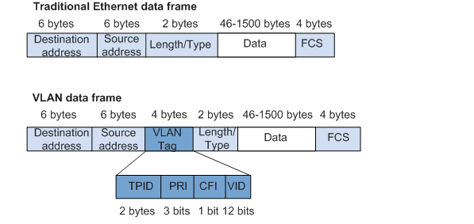

## Định nghĩa:
+  LAN(local area network):
- một nhóm các hệ thống máy tính được kết nối với nhau trên một khu vực có diện tích nhỏ

+  VLAN(Virtual LAN): là một nhóm máy tính được kết nối bằng một mạng LAN ảo, không kể khoảng cách địa lý giữa chúng

Broadcast domain là một phân đoạn mạng trong đó khi một thiết bị phát một gói, tất cả các thiết bị trên domain đó sẽ nhận được nó. Broadcast domain thường chỉ giới hạn ở các bộ chuyển mạch.

Phạm vi Vlan
- VLAN 0,4095: dành riêng cho VLAN không thể nhìn thấy hoặc sử dụng
- VLAN 1: VLAN mặc định của switch. không thể xóa hoặc chỉnh sửa nhưng có thể được sử dụng.
- VLAN 2-1001: đây là dải VLAN thông thường và có thể tạo, chỉnh sửa và xóa.
- VLAN 1002-1005: dùng cho FDDI và token ring. không thể bị xóa.
- VLAN 1006-4094: phạm vi mở rộng của VLAN

Token ring:
- là một giao thức truyền thông trong đó tất cả các thiết bị được kết nối trong một vòng. Mã thông báo(token) thường ở dạng mẫu bit đặc biệt hoặc gói tin nhỏ và được chuyển qua các thiết bị theo thứ tự được xác định trước. Nếu một thiết bị có dữ liệu đang chờ gửi và nhận được mã thông báo, thiết bị sẽ gửi những dữ liệu đó sau đó chuyển mã thông báo sang thiết bị tiếp theo. Nếu không, nó sẽ chỉ chuyển mã thông báo sang thiết bị tiếp theo.

FDDI(Fiber Distributed Data Interface):
- - là bộ tiêu chuẩn truyền dữ liệu trong mạng LAN qua cáp quang. Có thể mở rộng kết nối lên đến 200km. Nó dựa trên giao thức token ring.

Các tính năng chính:
1. VLAN tagging: là phương pháp xác định và phân biệt lưu lượng VLAN với lưu lượng mạng khác, thường bằng cách thêm VLAN tag vào tiêu đề khung Ethernet
2. VLAN membership: chỉ định các thiết bị mạng cho các Vlan cụ thể
+ static VLANs: người quản trị mạng tạo VLAN và gán port của switch vào VLAN (còn gọi là port-based VLAN). Các cổng VLAN không thay đổi cho đến khi administrator thay đổi việc gán port
+ Dynamic VLAN: switch tự động gán port vào một VLAN sử dụng thông tin từ người dùng như địa chỉ MAC hoặc địa chỉ IP. Khi một thiết bị được kết nối với một công tắc, switch sẽ tra cứu cơ sở dữ liệu để thiết lập tư cách thành viên Vlan. Khi chúng tôi di chuyển một thiết bị từ một port trên một switch này sang một switch khác, dynamic VLAN sẽ tự động định cấu hình tư cách thành viên của Vlan.
3. VLAN trunking: cho phép nhiều VLAN được truyền qua một liên kết vật lý duy nhất.
### Trunking 
khi chúng ta muốn kết nối hai hay nhiều switch lại với nhau để mở rộng số lượng port, trunking được sử dụng để kết nối các VLAN trên switch này với switch khác bằng cách sử dụng một liên kết duy nhất để kết nối tất cả các VLAN
- trunking được sử dụng để cải thiện khả năng mở rộng và tính linh hoạt của việc kết nối nhiều VlAN, thường là trên nhiều thiết bị chuyển mạch, với nhau

+ Gắn tag: Mỗi frame được truyền qua một trunklink được gắn VLAN tag. Tag thường được đặt trong header của Ethernet frame và cho biết frame đó thuộc về VLAN nào.
+ Chuyển tiếp frame: khi một frame đến trunking port, switch sẽ kiểm tra VLAN tag. Nếu frame không được gắn tag, nó được coi là thuộc về Vlan gốc và được chuyển tiếp đến đó. Nếu khung được gắn tag, switch sẽ xem liệu VLAN tương ứng có được cho phép trên trunk link không. Nếu nó được cho phép, frame sẽ được chuyển tiếp đến VLAN thích hợp. nếu VlAN ID cho thấy nó không được phép có ở trên trunk link , switch sẽ loại bỏ frame đó.

IEEE 802.1Q is a networking standard that supports VLAN on Ethernet networks. It provides the trunking mechanism by adding a VLAN tag into the ethernet header. The fields of the VLAN tags are shown below:

|Field|Length|Description|
|----|-----|-----|
|TPID|2 bytes|indicate frame type, for instance a value 0x8100 indicates an IEEE 802.1 Q frame|
|PRI|3 bits| indicates frame priority, a higher value means higher priority. If congestion occurs, the frame with higher priority is sent first.|
|CFI|1 bit| indicates whether MAC address is encapsulated in canonical format(0 if it is and 1 if it is in non-canonical format)|
|VID|12 bits|indicates the ID of the VLAN to which the frame belongs to|

## Nguồn tham khảo
1. [Nguồn 1](https://support.huawei.com/enterprise/en/doc/EDOC1100088104#fig208591149121117)
2. 

