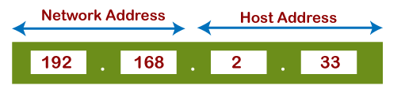

## Khái quát về IP
IP là một tập hợp các quy tắc được sử dụng để định tuyến địa chỉ các gói dữ liệu khi chúng di chuyển qua mạng và đến đích chính xác của chúng. Thông tin IP được gắn vào mỗi gói dữ liệu để giúp các bộ router gửi chúng qua mạng. Mỗi gói dữ liệu chứa thông tin IP của cả người gửi và người nhận gói dữ liệu. Một địa chỉ IP được cung cấp cho mỗi thiết bị hoặc domain name với internet để các gói dữ liệu có thể được chuyển hướng đến địa chỉ IP được đính kèm với chúng. Điều này cho phép dữ liệu đến nơi cần thiết.

IPv4 là địa chỉ 32 bit được sử dụng để xác định thiết bị trên mạng. Địa chỉ được chia thành các octet được phân tách bằng dấu chấm trên số địa chỉ.
## Cấu trúc của địa chỉ IPv4
Địa chỉ IPv4 có thể được chia thành hai phần: địa chỉ mạng (tiền tố mạng) và địa chỉ máy chủ (số máy chủ).

Địa chỉ mạng: chỉ định số duy nhất nào được gán cho mạng.
Địa chỉ máy chủ: chỉ định số duy nhất nào được gán cho mỗi thiết bị máy chủ. Các máy chủ trong cùng một mạng sẽ có cùng một địa chỉ mạng và sẽ được xác định theo địa chỉ máy chủ duy nhất của chúng.

## Address space
Address space của IPv4 được chia thành các lớp lớp địa chỉ khác nhau: lớp A, B, C, D và E.
|Lớp học| Phạm vi|Sử dụng|
|----|----|----|
|Lớp A|0.0.0.0 đến 127.255.255.255| sử dụng octet đầu tiên để xác định mạng và ba octet còn lại để xác định các máy chủ|
|Lớp B| 128.0.0.0 đến 191.255.255.255| hai octet đầu tiên để xác định mạng và hai octet còn lại để xác định các máy chủ|
|Lớp C|192.0.0.0 đến 223.255.255.255| ba octet đầu tiên để xác định mạng và octet cuối cùng được sử dụng để xác định máy chủ|
|Lớp D|224.0.0.0 đến 239.255.255.255|được sử dụng cho multicast communication, trong đó địa chỉ được sử dụng để gửi các gói dữ liệu đến nhiều máy chủ cùng một lúc|
|Lớp E|240.0.0.0 đến 255.255.255.255|dành riêng cho mục đích thử nghiệm|

## Private IPv4 addresses

## Subnet division
IPv4 supports the concept of subnetting, which allows the subdivision of a single network into smaller networks called subnets. This allows for more efficient allocation of IP address and enables better network management. 
